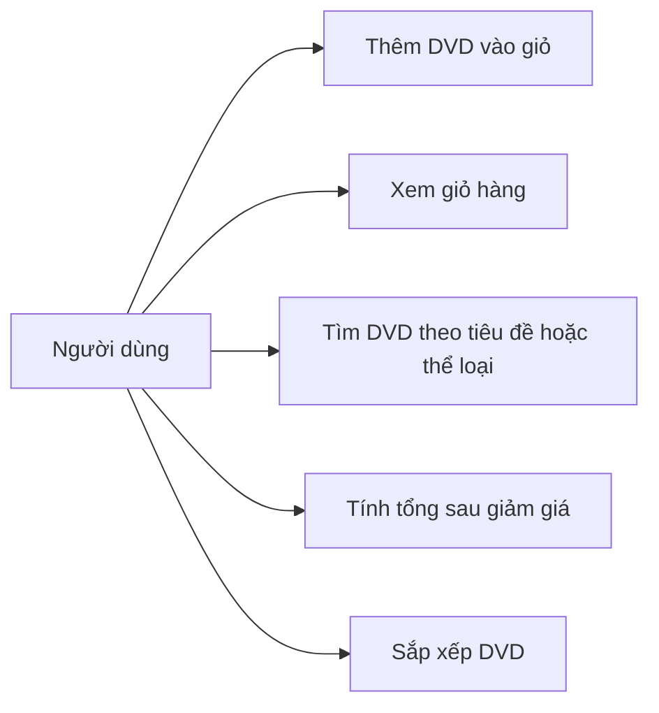

# AIMS-mini — Use cases

```mermaid
flowchart LR
    User[Người dùng] --> Add[Thêm DVD vào giỏ]
    User --> View[Xem giỏ hàng]
    User --> Search[Tìm DVD theo tiêu đề hoặc thể loại]
    User --> Discount[Tính tổng sau giảm giá]
    User --> Sort[Sắp xếp DVD]
```

Phạm vi là ứng dụng dòng lệnh mẫu; không có cơ sở dữ liệu hoặc thanh toán.
